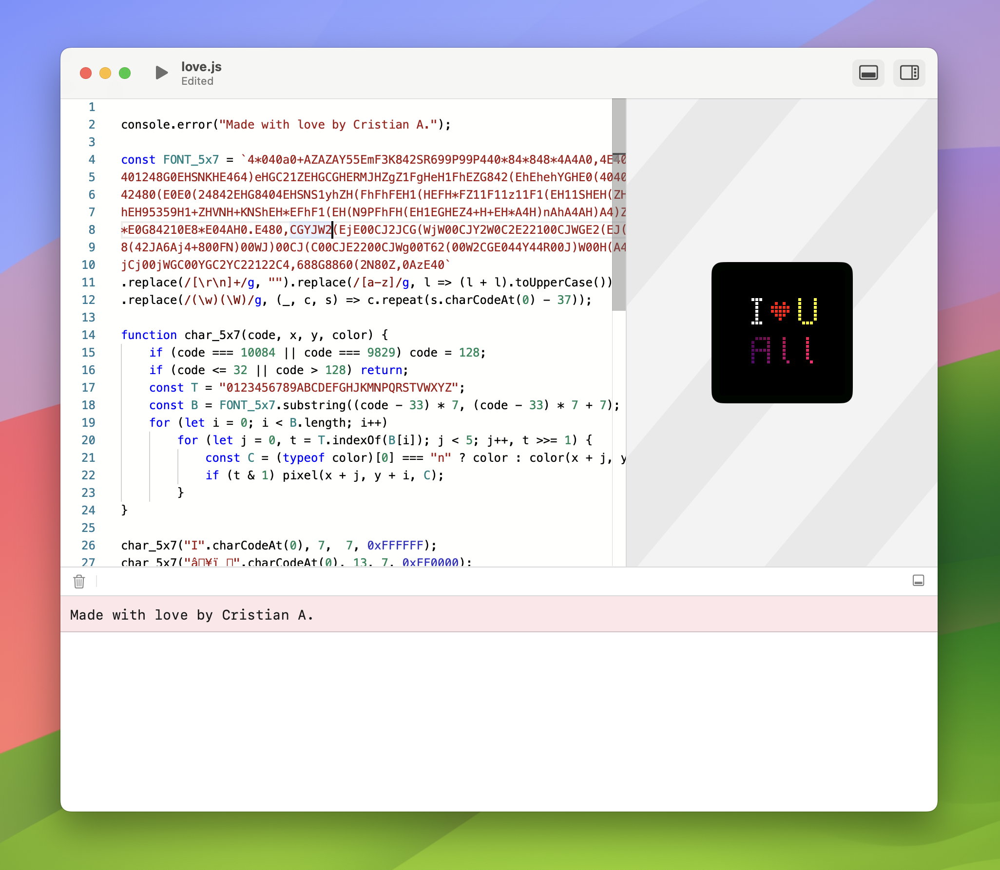
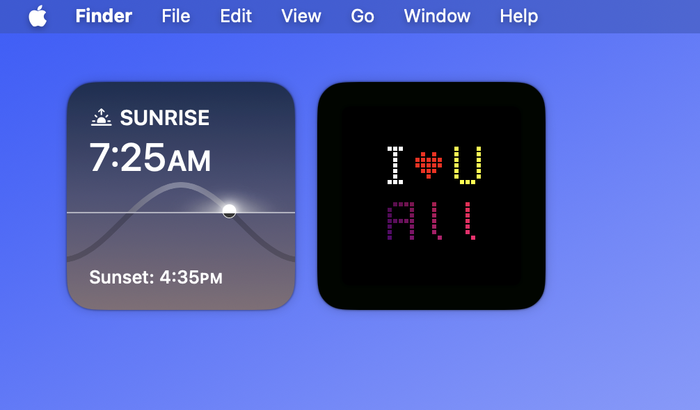

# LCDope

LCD Display Widget for macOS that runs **your** JavaScript code.





## API Usage

To interact with the widget, you can use the following javascript API.

```typescript
/// width of the screen in pixels
const WIDTH: number;
/// height of the screen in pixels
const HEIGHT: number;
/// date for the requested frame (might be a future date for prefetching)
const DATE: Date;
/// sets the pixel at (x, y) to the given rgb hex color
function pixel(x: number, y: number, color: number | string): void;
/// sets the grid color (a.k.a. the backlight color)
function backlight(color: number | string): void;
/// fills the screen with the given rgb hex color
function fill(color: number | string): void;
```

- Colors are usually hex numbers like `0xFF0000` or strings like `"#FF0000"`.
- You may use the `fetch` api along with top-level `await`, to get data from the internet.
- Some js features like timers and intervals are not available due to macOS widget restrictions.
- You may store persisting user data using `localStorage`.
