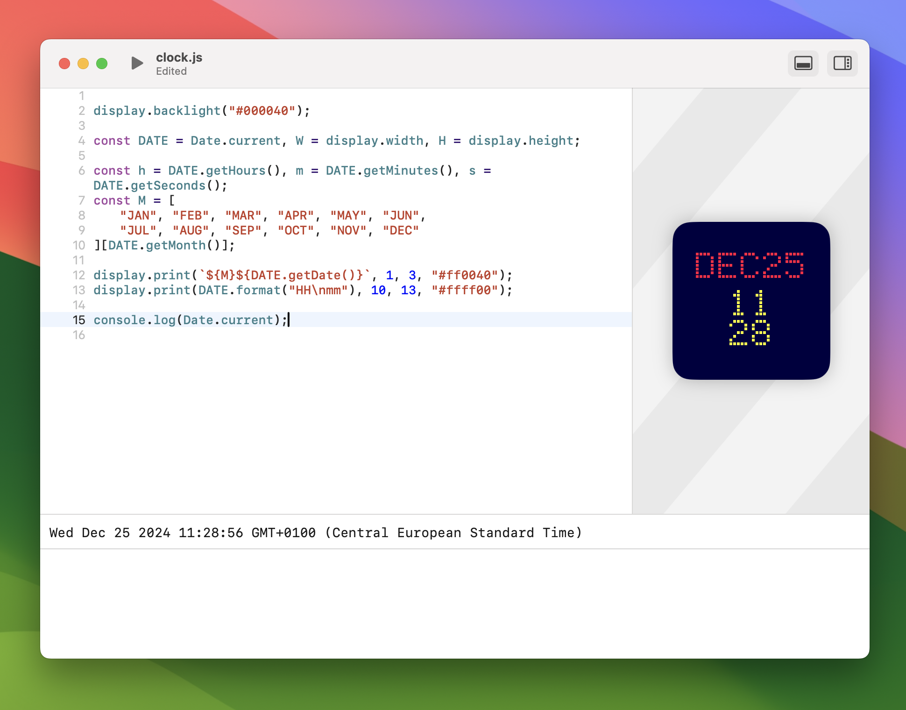

# LCDope

LCD Display Widget for macOS that runs **your** JavaScript code.\
You can choose between `32x32`, `60x24` or `60x60` pixels (_still in development_).




> **Note:** The built-in JavaScript editor is still in development and has some bugs.

## API Usage

To interact with the widget, you can use the following javascript API.

```typescript
/// date of the requested frame (might be a future date during prefetch).
const Date.current: Date;
/// width of the screen in pixels.
const display.width: number;
/// height of the screen in pixels.
const display.height: number;
/// sets the pixel at (x, y) to the given rgb hex color.
function display.pixel(x: number, y: number, color: number | string): void;
/// sets the background color (a.k.a. the backlight color).
function display.backlight(color: number | string): void;
/// clears the entire screen, turning all pixels off.
function display.clear(color: number | string): void;
/// fills the screen with the given rgb hex color.
function display.fill(color: number | string): void;
/// writes the given text at the specified position with a 5x7 font.
function display.print(message: string, x: number, y: number, color: number | string): void;
/// writes the given character at the specified position with a 5x7 font.
function display.character(c: string, x: number, y: number, color: number | string): void;
```

- Colors are usually hex numbers like `0xFF0000` or strings like `"#FF0000"`.
- You may pass a function `(x, y) => color` to functions expecting a color.
- You can also use the `rgb(r, g, b)` or `hsl(h, s, l)` functions to create a color.
- You may use the `fetch()` api along with top-level `await`, to get data from the internet.
- You may use `btoa()` and `atob()` to encode and decode base64 strings.
- Some js features like timers and intervals are not available due to macOS widget restrictions.
- You may store persisting user data using `localStorage`.

### Examples

#### Clock

```js
display.backlight("#000040");

const DATE = Date.current, W = display.width, H = display.height;

const h = DATE.getHours(), m = DATE.getMinutes(), s = DATE.getSeconds();
const M = [
	"JAN", "FEB", "MAR", "APR", "MAY", "JUN",
	"JUL", "AUG", "SEP", "OCT", "NOV", "DEC"
][DATE.getMonth()];

display.print(`${M}${DATE.getDate()}`, 1, 3, "#ff0040");
display.print(DATE.format("HH\nmm"), 10, 13, "#ffff00");

console.log(Date.current);
```
